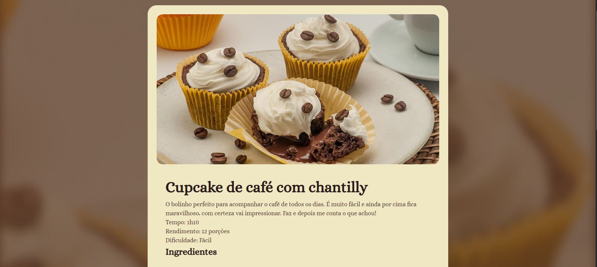

Página de Receita — Cupcake de Café

#Sobre o projeto

O projeto consiste em uma página de receita de Cupcake de Café com Chantilly. Essa página foi desenvolvida acompanhando as aulas do módulo
de HTML e CSS, no curso de formação FullStack da Rocketseat.

## Conhecimentos adquiridos

- Estrutura básica do HTML;
- HTML semântico;
- Títulos e parágrafos;
- Listas;
- Imagens e atributos alt;
- Seletores CSS;
- Classes e IDs;
- Reset de estilos com *;
- Variáveis e propriedades no :root;
- Margens e espaçamentos;
- Padding;
- margin;
- border-radius;
- background-image;
- background-size;
- box-sizing;
- Tipografia e fontes personalizadas;
- Organização e estilização de uma página

## Tecnologias utilizadas

- HTML
- CSS
- Google Fonts — Alice
- Live Server
- Git
- Git hub
- VScode

📸 Preview

 
⭐ Projeto desenvolvido para fins de aprendizado e prática de desenvolvimento web.